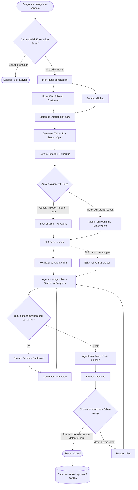
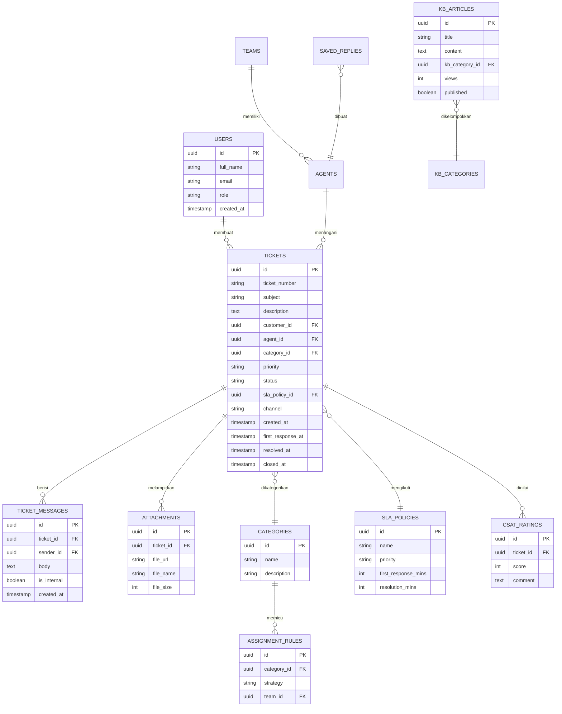
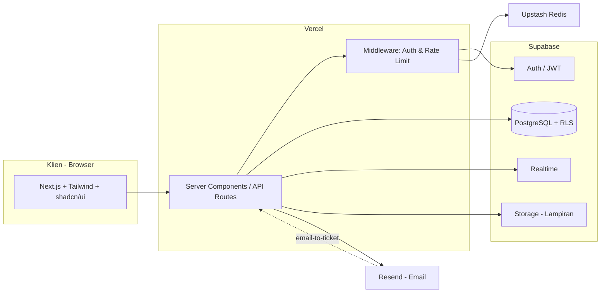
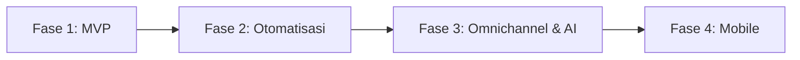

# Product Requirements Document (PRD)
## Aplikasi Ticketing / Helpdesk

| | |
|---|---|
| **Nama Produk** | HelpDesk App (nama sementara) |
| **Versi Dokumen** | 1.0 (Draft) |
| **Tanggal** | 6 Agustus 2026 |
| **Status** | Draft untuk Review |
| **Referensi** | [Frappe Helpdesk](https://github.com/frappe/helpdesk) |
| **Target Deploy** | Vercel |

---

## Daftar Isi

1. [Ringkasan Eksekutif](#1-ringkasan-eksekutif)
2. [Latar Belakang & Tujuan](#2-latar-belakang--tujuan)
3. [Sasaran & Metrik Keberhasilan](#3-sasaran--metrik-keberhasilan)
4. [Ruang Lingkup](#4-ruang-lingkup)
5. [Persona & Peran Pengguna](#5-persona--peran-pengguna)
6. [Asumsi & Batasan](#6-asumsi--batasan)
7. [Kebutuhan Fungsional](#7-kebutuhan-fungsional)
8. [Flowchart Sistem](#8-flowchart-sistem)
9. [Flowchart Peran Pengguna](#9-flowchart-peran-pengguna)
10. [Model Data (ERD)](#10-model-data-erd)
11. [Arsitektur & Teknologi](#11-arsitektur--teknologi)
12. [Kebutuhan Non-Fungsional](#12-kebutuhan-non-fungsional)
13. [Keamanan](#13-keamanan)
14. [Integrasi](#14-integrasi)
15. [Desain UI/UX](#15-desain-uiux)
16. [Roadmap Pengembangan](#16-roadmap-pengembangan)
17. [Risiko & Mitigasi](#17-risiko--mitigasi)
18. [Lampiran](#18-lampiran)

---

## 1. Ringkasan Eksekutif

HelpDesk App adalah aplikasi manajemen tiket (ticketing) berbasis web yang membantu tim support menerima, melacak, dan menyelesaikan permintaan bantuan dari pelanggan secara terstruktur. Aplikasi ini terinspirasi dari **Frappe Helpdesk** — dengan portal ganda (agent & customer), SLA, auto-assignment, knowledge base, dan saved replies — namun dibangun dengan stack modern yang **ringan, cepat, aman, dan siap di-deploy di Vercel**.

Tujuannya adalah menyediakan sistem support yang mudah digunakan, cepat diakses, dan mudah dikustomisasi, sehingga tim dapat merespons pelanggan lebih cepat dan konsisten.

---

## 2. Latar Belakang & Tujuan

### 2.1 Latar Belakang
Banyak organisasi masih menangani permintaan support melalui email, chat, atau spreadsheet yang tersebar. Cara ini menyebabkan:
- Permintaan terlewat atau lambat direspons.
- Tidak ada visibilitas terhadap status dan beban kerja tim.
- Sulit mengukur kualitas layanan (waktu respon, waktu penyelesaian).
- Pengetahuan berulang tidak terdokumentasi, sehingga pertanyaan yang sama dijawab berulang-ulang.

### 2.2 Tujuan Produk
- Menyediakan satu tempat terpusat untuk seluruh permintaan support.
- Mempercepat waktu respon dan penyelesaian melalui otomatisasi (routing, SLA, template balasan).
- Memberdayakan pelanggan untuk swalayan (self-service) melalui Knowledge Base.
- Memberikan visibilitas dan analitik bagi supervisor untuk pengambilan keputusan.

> **Catatan asumsi:** Use case utama diasumsikan **customer support umum** (dapat diadaptasi untuk internal IT helpdesk). Jika target sebenarnya berbeda (mis. layanan publik, MSP multi-klien), beberapa bagian perlu disesuaikan.

---

## 3. Sasaran & Metrik Keberhasilan

| Sasaran | Metrik (KPI) | Target Awal |
|---|---|---|
| Respon lebih cepat | First Response Time (FRT) rata-rata | < 1 jam (jam kerja) |
| Penyelesaian lebih cepat | Average Resolution Time | Turun 30% vs proses lama |
| Kepatuhan layanan | SLA Compliance Rate | > 90% |
| Kepuasan pelanggan | CSAT Score | > 4.2 / 5 |
| Efisiensi swalayan | Ticket Deflection Rate (via KB) | > 20% |
| Adopsi | Persentase tiket masuk via sistem (bukan email pribadi) | > 95% dalam 3 bulan |

---

## 4. Ruang Lingkup

### 4.1 Termasuk (In Scope) — MVP
- Manajemen tiket (buat, lihat, balas, ubah status, tutup, buka kembali).
- Portal Customer & Dashboard Agent (portal ganda).
- Kanal masuk: **Form Web** dan **Email-to-Ticket**.
- Kategori, prioritas, dan status tiket yang dapat dikonfigurasi.
- SLA (target respon & penyelesaian) beserta indikator pelanggaran.
- Auto-assignment berdasarkan aturan (kategori / beban kerja).
- Saved Replies / Canned Responses.
- Catatan internal antar-agent (tidak terlihat customer).
- Knowledge Base (artikel bantuan + pencarian).
- Notifikasi (in-app & email).
- Rating kepuasan (CSAT) setelah tiket selesai.
- Dashboard & laporan dasar.
- Manajemen pengguna & peran (RBAC).

### 4.2 Tidak Termasuk (Out of Scope) — MVP
- Aplikasi mobile native (Android/iOS) — cukup web responsif dulu.
- Live chat real-time & chatbot.
- Integrasi WhatsApp / media sosial.
- Multi-tenant penuh (banyak organisasi terpisah).
- Modul billing / penjualan.
- AI auto-reply & auto-kategorisasi (dipertimbangkan pada fase lanjutan).

> Item Out of Scope dijadwalkan pada [Roadmap](#16-roadmap-pengembangan) fase berikutnya.

---

## 5. Persona & Peran Pengguna

| Peran | Deskripsi | Kebutuhan Utama |
|---|---|---|
| **Customer (Pelapor)** | Pengguna akhir yang mengalami kendala. | Buat tiket mudah, pantau status, cari solusi mandiri. |
| **Agent** | Anggota tim support yang menangani tiket. | Antrean tiket jelas, balas cepat, kolaborasi internal. |
| **Supervisor / Manager** | Pemimpin tim support. | Visibilitas beban kerja, SLA, performa, laporan. |
| **Admin** | Pengelola konfigurasi sistem. | Atur user, SLA, aturan, kategori, KB, integrasi. |

### Matriks Hak Akses (RBAC)

| Aksi | Customer | Agent | Supervisor | Admin |
|---|:---:|:---:|:---:|:---:|
| Buat tiket | ✅ | ✅ | ✅ | ✅ |
| Lihat tiket sendiri | ✅ | ✅ | ✅ | ✅ |
| Lihat semua tiket tim | ❌ | ⚠️ (yang di-assign) | ✅ | ✅ |
| Balas tiket | ✅ | ✅ | ✅ | ✅ |
| Catatan internal | ❌ | ✅ | ✅ | ✅ |
| Assign / reassign | ❌ | ⚠️ (terbatas) | ✅ | ✅ |
| Kelola SLA & aturan | ❌ | ❌ | ⚠️ (lihat) | ✅ |
| Kelola user & peran | ❌ | ❌ | ❌ | ✅ |
| Kelola Knowledge Base | ❌ | ⚠️ (usul) | ✅ | ✅ |
| Lihat laporan | ❌ | ⚠️ (pribadi) | ✅ | ✅ |

Keterangan: ✅ = penuh, ⚠️ = terbatas, ❌ = tidak ada akses.

---

## 6. Asumsi & Batasan

**Asumsi:**
- Satu organisasi tunggal (single-tenant) untuk MVP.
- Bahasa antarmuka: Indonesia (dengan struktur siap multi-bahasa).
- Volume awal: ± 10–30 agent, ratusan hingga ribuan tiket/bulan.
- Pengguna mengakses via browser desktop & mobile (web responsif).
- Email transaksional dikirim via layanan pihak ketiga (mis. Resend).

**Batasan:**
- Frontend & serverless functions berjalan di Vercel; database di-host terpisah (Supabase).
- Fitur real-time bergantung pada layanan Supabase Realtime.
- Anggaran & timeline detail belum ditentukan — roadmap bersifat indikatif.

---

## 7. Kebutuhan Fungsional

Setiap kebutuhan ditulis sebagai user story + kriteria penerimaan ringkas.

### 7.1 Manajemen Tiket
- **F-01** Sebagai *customer*, saya dapat membuat tiket dengan subjek, deskripsi, kategori, dan lampiran.
  - Kriteria: Tiket tersimpan dengan ID unik, status awal `Open`, dan customer menerima notifikasi konfirmasi.
- **F-02** Sebagai *agent*, saya dapat melihat daftar tiket dengan filter (status, prioritas, kategori, assignee) dan pencarian.
- **F-03** Sebagai *agent*, saya dapat membalas tiket, mengubah status, prioritas, dan assignee.
- **F-04** Sebagai *agent*, saya dapat menambah **catatan internal** yang tidak terlihat oleh customer.
- **F-05** Sistem menampilkan riwayat percakapan (timeline) lengkap pada setiap tiket.
- **F-06** Sebagai *customer*, saya dapat membuka kembali (reopen) tiket yang sudah `Resolved` dalam rentang waktu tertentu.

### 7.2 Kanal Masuk
- **F-07** Tiket dapat dibuat melalui **form web** di portal customer.
- **F-08** Email yang masuk ke alamat support tertentu otomatis menjadi tiket (**email-to-ticket**); balasan email menyambung ke thread tiket yang sama.

### 7.3 Klasifikasi & Prioritas
- **F-09** Admin dapat mengelola daftar **kategori**, **prioritas** (mis. Low/Medium/High/Urgent), dan **status** tiket.
- **F-10** Prioritas dapat memengaruhi target SLA dan urutan tampil.

### 7.4 SLA (Service Level Agreement)
- **F-11** Admin dapat mendefinisikan kebijakan SLA: target **First Response** dan **Resolution** per prioritas.
- **F-12** Sistem menghitung sisa waktu SLA dan menandai tiket yang **mendekati/melewati** batas (indikator warna).
- **F-13** Sistem dapat melakukan **eskalasi otomatis** (notifikasi ke supervisor) saat SLA hampir terlanggar.

### 7.5 Auto-Assignment
- **F-14** Admin dapat membuat **aturan penugasan** berdasarkan kategori/prioritas.
- **F-15** Sistem dapat mendistribusikan tiket secara **round-robin** atau berdasarkan **beban kerja** agent.
- **F-16** Supervisor dapat melakukan reassignment manual.

### 7.6 Saved Replies
- **F-17** Agent dapat menyimpan & menggunakan **template balasan** untuk pertanyaan umum.
- **F-18** Template mendukung variabel dinamis (mis. `{nama_customer}`, `{nomor_tiket}`).

### 7.7 Knowledge Base
- **F-19** Admin/Supervisor dapat membuat & mengelola **artikel bantuan** (dengan kategori).
- **F-20** Customer dapat mencari & membaca artikel; saat membuat tiket, sistem menyarankan artikel relevan.
- **F-21** Statistik keterbacaan artikel (views, "membantu / tidak membantu") tercatat.

### 7.8 Notifikasi
- **F-22** Notifikasi in-app & email untuk: tiket baru, balasan baru, perubahan status, penugasan, dan peringatan SLA.

### 7.9 CSAT
- **F-23** Setelah tiket `Resolved/Closed`, customer diminta memberi rating & komentar kepuasan.

### 7.10 Laporan & Dashboard
- **F-24** Dashboard menampilkan: jumlah tiket per status, SLA compliance, rata-rata FRT & resolution time, beban per agent, dan tren volume.
- **F-25** Laporan dapat difilter berdasarkan rentang tanggal, kategori, dan agent, serta dapat diekspor (CSV).

### 7.11 Administrasi & RBAC
- **F-26** Admin dapat mengelola pengguna, mengundang agent, dan menetapkan peran.
- **F-27** Semua aksi sensitif tercatat dalam **audit log**.

---

## 8. Flowchart Sistem

Diagram berikut menggambarkan alur sebuah tiket dari awal masuk hingga selesai.

---

## 9. Flowchart Peran Pengguna

Diagram berikut menggambarkan alur akses dan kapabilitas tiap peran setelah login.

```mermaid
flowchart TD
    Start([Login ke Sistem]) --> Auth{Verifikasi Peran / RBAC}

    Auth -->|Customer| CU[Portal Customer]
    Auth -->|Agent| AG[Dashboard Agent]
    Auth -->|Supervisor| SV[Dashboard Supervisor]
    Auth -->|Admin| AD[Panel Admin]

    CU --> CU1[Buat tiket baru]
    CU --> CU2[Lihat status tiket sendiri]
    CU --> CU3[Balas & tambah lampiran]
    CU --> CU4[Akses Knowledge Base]
    CU --> CU5[Beri rating kepuasan CSAT]

    AG --> AG1[Lihat tiket yang di-assign]
    AG --> AG2[Balas & ubah status tiket]
    AG --> AG3[Gunakan Saved Replies]
    AG --> AG4[Tambah catatan internal]
    AG --> AG5[Eskalasi tiket ke Supervisor]

    SV --> SV1[Lihat semua tiket tim]
    SV --> SV2[Reassign / distribusi tiket]
    SV --> SV3[Pantau SLA & performa agent]
    SV --> SV4[Kelola laporan & dashboard]
    SV --> SV5[Kelola Knowledge Base]

    AD --> AD1[Kelola user & peran]
    AD --> AD2[Atur SLA & assignment rules]
    AD --> AD3[Kelola kategori, prioritas, kanal]
    AD --> AD4[Kelola template & Knowledge Base]
    AD --> AD5[Konfigurasi integrasi & keamanan]
    AD --> AD6[Akses audit log]
```

---

## 10. Model Data (ERD)

Gambaran entitas inti dan relasinya.

---

## 11. Arsitektur & Teknologi

### 11.1 Rekomendasi Stack (Vercel-ready)

Dipilih karena **ringan, cepat, aman, siap pakai, dan mudah dikustomisasi**, serta menghasilkan tampilan modern & bersih menyerupai Frappe Helpdesk.

| Lapisan | Teknologi | Alasan |
|---|---|---|
| **Framework Utama** | **Next.js (App Router) + TypeScript** | Native untuk Vercel; SSR/ISR untuk performa & SEO; ekosistem besar; mudah dikustomisasi. |
| **UI / Styling** | **Tailwind CSS + shadcn/ui** | Komponen siap pakai, aksesibel, dan mudah di-*restyle*; menghasilkan tampilan bersih ala Frappe UI. |
| **Data Fetching** | **TanStack Query** | Caching, state server yang efisien. |
| **Validasi** | **Zod** | Validasi input & tipe end-to-end. |
| **Backend/DB** | **Supabase (PostgreSQL)** | Database relasional andal + **Auth**, **Storage**, **Realtime**, dan **Row Level Security** dalam satu paket. Gratis untuk mulai, aman, dan mudah diintegrasikan dengan Vercel. |
| **ORM (opsional)** | **Drizzle ORM** | Ringan, type-safe, cocok untuk serverless. |
| **Autentikasi** | **Supabase Auth** (alternatif: Auth.js) | Login email/OAuth, JWT, dan integrasi RLS. |
| **Email** | **Resend** | Mudah dipakai di serverless untuk email transaksional & email-to-ticket. |
| **Rate limiting/Cache** | **Upstash Redis** | Serverless, cocok untuk Vercel. |
| **Deploy** | **Vercel** (frontend + serverless functions) + Supabase (DB terkelola) | Deployment cepat, CI/CD otomatis, HTTPS bawaan. |

> **Framework siap pakai:** Untuk mempercepat, basis proyek dapat dimulai dari **starter Next.js + Supabase resmi** dan **template dashboard shadcn/ui**, lalu dikustomisasi sesuai kebutuhan helpdesk. Ini menghindari membangun dari nol namun tetap fleksibel.

### 11.2 Diagram Arsitektur

### 11.3 Pertimbangan Alternatif
- **Remix** atau **SvelteKit** juga berjalan baik di Vercel — dipilih Next.js karena ekosistem & template terluas.
- Jika ingin backend terpisah penuh, dapat memakai **NestJS/Express** di serverless, namun menambah kompleksitas. Untuk MVP, pendekatan **Next.js + Supabase** lebih ramping.

---

## 12. Kebutuhan Non-Fungsional

| Kategori | Kebutuhan |
|---|---|
| **Performa** | Waktu muat halaman utama < 2 detik; skor Lighthouse > 90; pagination & indexing untuk daftar tiket besar. |
| **Skalabilitas** | Arsitektur serverless auto-scale; database dengan indeks pada kolom yang sering di-*query*. |
| **Ketersediaan** | Target uptime > 99.5% (mengikuti SLA Vercel & Supabase). |
| **Responsif** | Mendukung desktop, tablet, dan mobile (mobile-first). |
| **Aksesibilitas** | Mengikuti WCAG 2.1 AA (komponen shadcn/ui aksesibel). |
| **Multi-bahasa (i18n)** | Struktur teks siap diterjemahkan (mis. `next-intl`). |
| **Observability** | Logging, error tracking (mis. Sentry), dan analitik dasar. |
| **Maintainability** | Kode modular, TypeScript ketat, dokumentasi, dan pengujian dasar. |

---

## 13. Keamanan

Keamanan menjadi prioritas karena aplikasi menyimpan data pelanggan.

- **Autentikasi & Sesi:** JWT via Supabase Auth; sesi aman; dukungan OAuth & (opsional) 2FA.
- **Otorisasi:** **Row Level Security (RLS)** di PostgreSQL — customer hanya bisa melihat tiketnya sendiri; agent sesuai penugasan; berdasarkan peran.
- **Enkripsi:** HTTPS/TLS di seluruh koneksi (bawaan Vercel); data at-rest terenkripsi di Supabase.
- **Validasi Input:** Validasi & sanitasi dengan Zod di sisi server untuk mencegah injeksi & XSS.
- **Proteksi API:** Rate limiting (Upstash), proteksi CSRF, dan secure HTTP headers.
- **Lampiran Aman:** Unggahan divalidasi tipe & ukuran; disimpan di Supabase Storage dengan **signed URL** (akses terbatas waktu).
- **Manajemen Rahasia:** Semua kredensial di **Environment Variables** Vercel, tidak pernah di kode.
- **Audit Log:** Pencatatan aksi sensitif (perubahan peran, penghapusan, konfigurasi).
- **Privasi/Kepatuhan:** Siapkan mekanisme retensi & penghapusan data sesuai kebutuhan regulasi (mis. UU PDP Indonesia).

> **Catatan:** Jika ada kebutuhan kepatuhan khusus (data harus di dalam negeri, ISO 27001, dsb.), harap dikonfirmasi karena akan memengaruhi pemilihan region hosting.

---

## 14. Integrasi

| Integrasi | Status | Keterangan |
|---|---|---|
| Email (masuk & keluar) | MVP | Email-to-ticket & notifikasi via Resend. |
| Realtime updates | MVP | Pembaruan tiket langsung via Supabase Realtime. |
| Single Sign-On (OAuth) | Opsional | Google/Microsoft untuk agent internal. |
| Webhook | Fase 2 | Kirim event tiket ke sistem lain. |
| WhatsApp / Chat | Fase 2+ | Kanal tambahan. |
| CRM/ERP | Fase 3 | Sinkronisasi data pelanggan. |
| AI (auto-reply, kategorisasi, ringkasan) | Fase 3 | Memanfaatkan LLM untuk saran balasan. |

---

## 15. Desain UI/UX

Mengacu pada tampilan Frappe Helpdesk: **bersih, modern, dan fungsional**.

**Prinsip desain:**
- Antarmuka minimalis, fokus pada daftar & detail tiket.
- Portal ganda dengan navigasi jelas (customer vs agent).
- Warna status & prioritas yang konsisten (mis. merah untuk Urgent/SLA breach).
- Aksi cepat: filter, pencarian, dan pintasan keyboard.

**Halaman utama (MVP):**
1. **Portal Customer:** beranda + Knowledge Base, form buat tiket, daftar tiket saya, detail tiket.
2. **Dashboard Agent:** daftar tiket (dengan filter & tampilan tabel), detail tiket + timeline percakapan, panel saved replies & catatan internal.
3. **Dashboard Supervisor:** ringkasan metrik, tabel semua tiket, laporan.
4. **Panel Admin:** manajemen user, SLA, aturan, kategori, KB, integrasi.

> Komponen dari **shadcn/ui** (tabel, dialog, dropdown, badge, form) mempercepat pembuatan tampilan serupa Frappe UI dan tetap mudah dikustomisasi.

---

## 16. Roadmap Pengembangan

| Fase | Fokus | Fitur Utama |
|---|---|---|
| **Fase 1 — MVP** | Fondasi ticketing | Auth & RBAC, CRUD tiket, portal ganda, form web + email-to-ticket, kategori/prioritas/status, SLA dasar, auto-assignment, saved replies, KB, notifikasi, CSAT, dashboard dasar. |
| **Fase 2 — Otomatisasi & Kolaborasi** | Efisiensi | Webhook, aturan SLA & eskalasi lanjutan, laporan lanjutan + ekspor, SSO, tim & antrean lanjutan. |
| **Fase 3 — Omnichannel & AI** | Perluasan | WhatsApp/live chat, integrasi CRM/ERP, AI (saran balasan, auto-kategorisasi, ringkasan), multi-tenant. |
| **Fase 4 — Mobile** | Aksesibilitas | Aplikasi mobile (PWA atau native). |

---

## 17. Risiko & Mitigasi

| Risiko | Dampak | Mitigasi |
|---|---|---|
| Ketergantungan pada Supabase (vendor lock-in) | Sedang | Gunakan PostgreSQL standar & ORM agar bisa migrasi; abstraksi layer data. |
| Batas serverless Vercel (timeout/cold start) | Sedang | Optimasi query, gunakan caching & background job untuk tugas berat. |
| Volume email-to-ticket tinggi | Sedang | Gunakan antrean & idempotensi untuk mencegah tiket ganda. |
| Kebocoran data | Tinggi | Terapkan RLS, audit log, enkripsi, dan review keamanan berkala. |
| Scope creep | Sedang | Kunci ruang lingkup MVP; fitur tambahan masuk backlog. |
| Kepatuhan regulasi belum jelas | Sedang | Konfirmasi kebutuhan kepatuhan sejak awal. |

---

## 18. Lampiran

### 18.1 Glosarium
- **SLA (Service Level Agreement):** kesepakatan target waktu respon & penyelesaian.
- **FRT (First Response Time):** waktu hingga balasan pertama agent.
- **CSAT:** skor kepuasan pelanggan.
- **RBAC (Role-Based Access Control):** kontrol akses berbasis peran.
- **RLS (Row Level Security):** keamanan tingkat baris di database.
- **KB (Knowledge Base):** basis pengetahuan/artikel bantuan.
- **Canned/Saved Reply:** template balasan siap pakai.

### 18.2 Status Tiket (usulan)
`Open` → `In Progress` → `Pending Customer` → `Resolved` → `Closed` (dengan kemungkinan `Reopened`).

### 18.3 Referensi
- Frappe Helpdesk — https://github.com/frappe/helpdesk
- Dokumentasi Frappe Helpdesk — https://docs.frappe.io/helpdesk

### 18.4 Pertanyaan Terbuka (perlu konfirmasi)
1. Use case pasti: customer support umum, internal IT, atau lainnya?
2. Single organisasi atau multi-tenant?
3. Perlu SSO/2FA sejak MVP?
4. Kebutuhan kepatuhan/regulasi khusus (lokasi data, sertifikasi)?
5. Target timeline & ukuran tim pengembang?

---

*Dokumen ini adalah draft v1.0 dan akan diperbarui setelah review serta konfirmasi atas asumsi di atas.*
