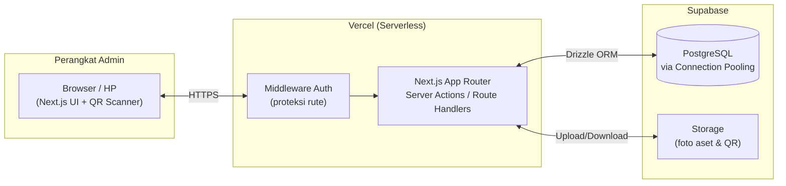
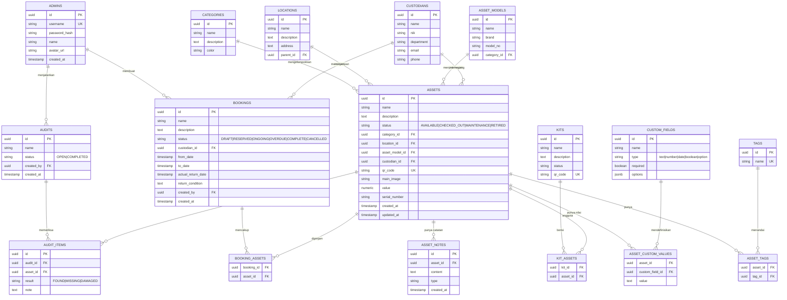
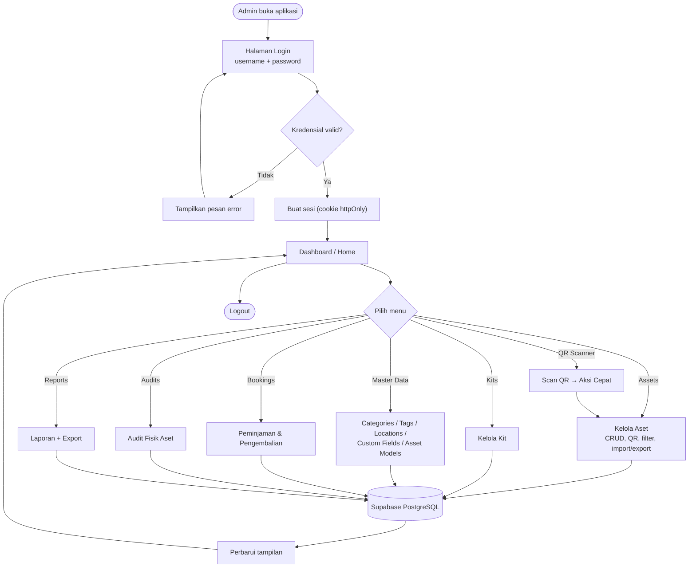
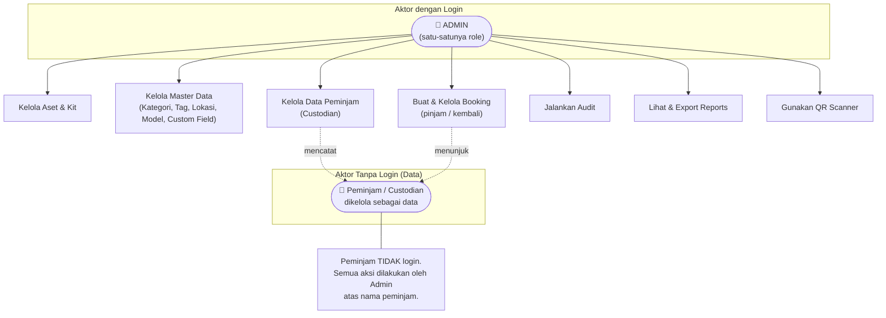
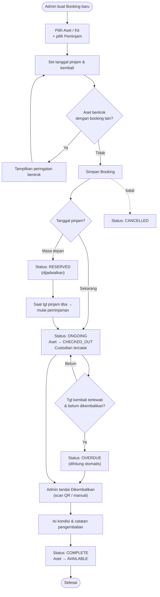
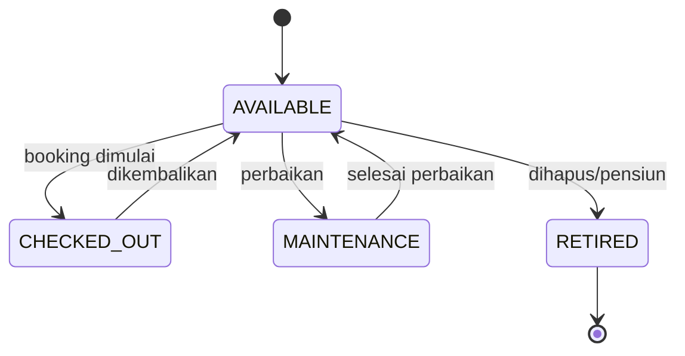
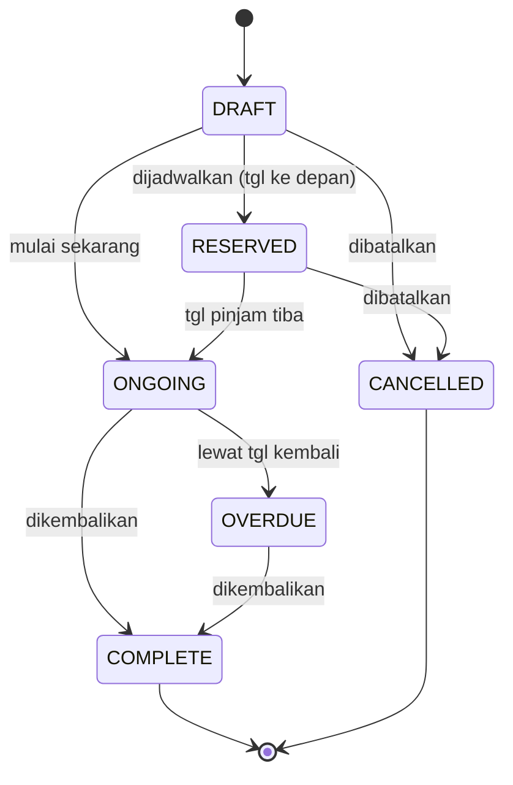

# Product Requirements Document (PRD)

> **Catatan (Agu 2026):** Produk ini berganti nama menjadi **SIGAP —
> Sistem Integrasi Guna Aset & Pelayanan**. Dokumen ini sengaja
> dipertahankan memakai nama lama "Pinjamin" sebagai rekaman historis
> keputusan awal; tidak ada perubahan lingkup atau fitur.
# Pinjamin — Smart Asset Lending (Garuda Food)

| | |
|---|---|
| **Nama Produk** | Pinjamin — Smart Asset Lending |
| **Organisasi** | Garuda Food |
| **Versi Dokumen** | 1.1 |
| **Tanggal** | 6 Agustus 2026 |
| **Status** | Draft untuk Review |
| **Perubahan v1.1** | Menambahkan kebutuhan **responsive / mobile-first** (§7.1) karena aplikasi diakses dari HP. |
| **Jenis Aplikasi** | Web App (Admin-only) — Asset Management & Lending |
| **Referensi Fitur** | shelf.nu (open-source, dibangun ulang — bukan fork) |

---

## Daftar Isi

1. [Ringkasan Eksekutif](#1-ringkasan-eksekutif)
2. [Latar Belakang & Tujuan](#2-latar-belakang--tujuan)
3. [Ruang Lingkup (Scope)](#3-ruang-lingkup-scope)
4. [Pengguna & Role](#4-pengguna--role)
5. [Terminologi](#5-terminologi)
6. [Kebutuhan Fungsional (Functional Requirements)](#6-kebutuhan-fungsional-functional-requirements)
7. [Kebutuhan Non-Fungsional](#7-kebutuhan-non-fungsional)
8. [Spesifikasi Teknis & Arsitektur](#8-spesifikasi-teknis--arsitektur)
9. [Skema Database](#9-skema-database)
10. [Flowchart Sistem](#10-flowchart-sistem)
11. [Flowchart User Role](#11-flowchart-user-role)
12. [Flowchart Alur Peminjaman](#12-flowchart-alur-peminjaman)
13. [State Machine Status](#13-state-machine-status)
14. [Sitemap & Struktur Halaman](#14-sitemap--struktur-halaman)
15. [Keamanan](#15-keamanan)
16. [Deployment](#16-deployment)
17. [Roadmap & Milestone](#17-roadmap--milestone)
18. [Risiko & Mitigasi](#18-risiko--mitigasi)
19. [Lampiran](#19-lampiran)

---

## 1. Ringkasan Eksekutif

**Pinjamin** adalah aplikasi web berbasis **Next.js + TypeScript** untuk mengelola aset fisik milik Garuda Food dan proses **peminjaman (lending)** aset tersebut. Aplikasi ini bersifat **admin-only**: hanya administrator yang login ke sistem, sedangkan peminjam (custodian) dikelola sebagai data oleh admin — tidak ada registrasi atau portal untuk pengguna umum.

Sistem memungkinkan admin untuk mendata aset, menandai QR Code pada setiap aset, mengelompokkan aset (kategori, tag, lokasi, model, kit), mencatat peminjaman dengan tanggal pinjam–kembali, memantau keterlambatan (overdue), melakukan audit fisik, dan menghasilkan laporan.

Aplikasi di-deploy ke **Vercel** dengan database **Supabase (PostgreSQL)**, dipilih karena ringan, cepat, aman, dan gratis di tier awal.

---

## 2. Latar Belakang & Tujuan

### 2.1 Latar Belakang
Garuda Food memiliki banyak aset (peralatan, perangkat, alat kerja) yang sering dipinjam-pakai antar karyawan/departemen. Tanpa sistem terpusat, riwayat "aset ada di mana dan dipegang siapa" sulit dilacak, aset hilang/telat kembali tidak terpantau, dan pelaporan dilakukan manual.

### 2.2 Tujuan Produk
| Kode | Tujuan |
|------|--------|
| G-1 | Menyediakan katalog aset terpusat yang mudah dicari dan difilter. |
| G-2 | Mempercepat proses peminjaman & pengembalian aset melalui pencatatan digital dan QR Code. |
| G-3 | Memberi visibilitas real-time atas status aset (tersedia, dipinjam, telat, maintenance). |
| G-4 | Mengurangi kehilangan aset dengan pelacakan custodian dan reminder keterlambatan (via status Overdue). |
| G-5 | Menghasilkan laporan peminjaman & inventaris secara instan (termasuk export). |

### 2.3 Metrik Keberhasilan (contoh)
- 100% aset tercatat di sistem dalam 1 bulan pertama.
- Waktu proses 1 transaksi peminjaman < 1 menit.
- Aset overdue dapat teridentifikasi 100% otomatis.

---

## 3. Ruang Lingkup (Scope)

### 3.1 Termasuk dalam Scope (In-Scope)
- Autentikasi **admin** (username + password).
- Dashboard (Home).
- Manajemen **Assets** (CRUD, QR, foto, status, custodian).
- Manajemen **Kits** (bundel aset).
- Manajemen master data: **Categories, Tags, Locations, Custom Fields, Asset Models**.
- **Bookings** (peminjaman + pengembalian, status, kalender).
- **Audits** (audit/pengecekan fisik aset).
- **Reports** (laporan + export, mengikuti gaya shelf.nu).
- **QR Scanner** (scan untuk aksi cepat pada aset).
- Data **peminjam/custodian** dikelola oleh admin (tanpa login).

### 3.2 Di Luar Scope (Out-of-Scope)
- Registrasi & login untuk pengguna umum / peminjam.
- Fitur **Reminders** (dihilangkan sesuai keputusan — tidak ada modul reminder).
- Multi-workspace / multi-tenant (hanya **satu** workspace: "Garuda Food").
- Pembayaran/billing (Stripe pada shelf.nu tidak dipakai).
- Aplikasi mobile native (cukup web yang mobile-friendly/PWA).
- Sistem approval berjenjang (hanya 1 role admin, tidak ada alur persetujuan).

---

## 4. Pengguna & Role

### 4.1 Role Sistem
Sistem hanya memiliki **satu role login**:

| Role | Login? | Deskripsi | Hak Akses |
|------|--------|-----------|-----------|
| **Admin** | ✅ Ya | Administrator sistem (mis. `adminsystem`) | **Akses penuh** ke seluruh menu & modul (create, read, update, delete). |

### 4.2 Aktor Non-Login (Entitas Data)
| Aktor | Login? | Deskripsi |
|-------|--------|-----------|
| **Peminjam / Custodian** | ❌ Tidak | Karyawan yang meminjam aset. Disimpan sebagai **data** (nama, departemen, kontak) yang dikelola admin — mengikuti konsep "team member / custodian" pada shelf.nu. Tidak pernah login ke sistem. |

> **Catatan penting:** Karena hanya ada 1 role, tidak ada logika perbedaan hak akses antar-pengguna. Semua orang yang bisa login adalah Admin dengan akses penuh. Peminjam murni sebagai data, bukan akun.

---

## 5. Terminologi

| Istilah | Arti |
|---------|------|
| **Asset** | Objek fisik yang dikelola & dipinjamkan (mis. laptop, proyektor). |
| **Kit** | Kumpulan aset yang dipinjam sebagai satu paket (mis. laptop + charger + tas). |
| **Category** | Pengelompokan utama aset (mis. Elektronik, Kendaraan). |
| **Tag** | Label fleksibel lintas-kategori (mis. "Prioritas", "Rusak Ringan"). |
| **Location** | Lokasi penyimpanan aset (bisa hierarkis: gedung → lantai → ruang). |
| **Custom Field** | Kolom metadata tambahan buatan admin (mis. Tgl Pembelian, No. Seri). |
| **Asset Model** | Spesifikasi/model dari aset (mis. "MacBook Air M2 13\""). |
| **Custodian** | Orang yang sedang memegang/meminjam aset. |
| **Booking** | Transaksi peminjaman aset dengan periode (tanggal pinjam & kembali). |
| **Audit** | Sesi pengecekan/verifikasi keberadaan & kondisi aset. |
| **Overdue** | Status booking yang melewati tanggal kembali & belum dikembalikan. |

---

## 6. Kebutuhan Fungsional (Functional Requirements)

Modul disusun mengikuti **sidebar** pada desain: Home, Assets, Kits, Categories, Tags, Locations, Custom Fields, Asset Models, Audits, Bookings, Reports, dan QR Scanner.

### 6.1 Autentikasi (Login Admin)
| ID | Kebutuhan |
|----|-----------|
| FR-AUTH-1 | Halaman login menampilkan logo, judul "Selamat Datang", field **Username** (wajib), field **Password** (dengan toggle lihat/sembunyikan), dan tombol **Login Admin**. |
| FR-AUTH-2 | Login memakai **username + password** (bukan email). |
| FR-AUTH-3 | Password disimpan dalam bentuk **hash (bcrypt)**, tidak pernah plaintext. |
| FR-AUTH-4 | Sesi menggunakan cookie **httpOnly** yang aman; ada rate-limit percobaan login. |
| FR-AUTH-5 | Semua halaman selain `/login` **dilindungi**; akses tanpa sesi valid dialihkan ke `/login`. |
| FR-AUTH-6 | Ada fungsi **Logout**. |

### 6.2 Home (Dashboard)
| ID | Kebutuhan |
|----|-----------|
| FR-HOME-1 | Menampilkan ringkasan: total aset, aset tersedia, aset dipinjam, aset overdue. |
| FR-HOME-2 | Menampilkan daftar booking terbaru & booking yang akan/telah jatuh tempo. |
| FR-HOME-3 | Menampilkan aktivitas terakhir (activity log ringkas). |

### 6.3 Assets
| ID | Kebutuhan |
|----|-----------|
| FR-AST-1 | Menampilkan daftar aset dalam **tabel** dengan kolom: nama, kategori, status, lokasi, custodian. |
| FR-AST-2 | Mendukung **pencarian** (search assets) & **Quick find (⌘K)**. |
| FR-AST-3 | Mendukung **filter**: Categories, Tags, Locations, Custodian; serta **sorting** (mis. Date created). |
| FR-AST-4 | Mendukung toggle tampilan **List / Calendar** dan mode **Simple / Advanced**. |
| FR-AST-5 | **Create/Edit/Delete** aset: nama, deskripsi, kategori, lokasi, model, tag, custom fields, foto utama, nilai/harga, no. seri. |
| FR-AST-6 | Setiap aset otomatis punya **QR Code** unik yang dapat dilihat, di-download, dan dicetak. |
| FR-AST-7 | Status aset: `AVAILABLE`, `CHECKED_OUT` (dipinjam), `MAINTENANCE`, `RETIRED`. |
| FR-AST-8 | Menampilkan **riwayat** & **catatan (notes)** per aset (audit trail). |
| FR-AST-9 | **Import** aset massal dari CSV dan **Export** ke CSV. |
| FR-AST-10 | Pagination dengan pilihan jumlah baris per halaman (mis. 20). |

### 6.4 Kits
| ID | Kebutuhan |
|----|-----------|
| FR-KIT-1 | CRUD kit: nama, deskripsi, daftar aset anggota. |
| FR-KIT-2 | Kit memiliki QR Code sendiri; meminjam kit = meminjam semua aset di dalamnya. |
| FR-KIT-3 | Status kit mengikuti ketersediaan aset anggotanya. |

### 6.5 Categories
| ID | Kebutuhan |
|----|-----------|
| FR-CAT-1 | CRUD kategori: nama, deskripsi, warna. |
| FR-CAT-2 | Satu aset memiliki satu kategori. |

### 6.6 Tags
| ID | Kebutuhan |
|----|-----------|
| FR-TAG-1 | CRUD tag: nama. |
| FR-TAG-2 | Satu aset dapat memiliki banyak tag (many-to-many). |

### 6.7 Locations
| ID | Kebutuhan |
|----|-----------|
| FR-LOC-1 | CRUD lokasi: nama, deskripsi, alamat. |
| FR-LOC-2 | Mendukung struktur **hierarkis** (lokasi induk & anak). |
| FR-LOC-3 | Aset dapat ditautkan ke satu lokasi. |

### 6.8 Custom Fields
| ID | Kebutuhan |
|----|-----------|
| FR-CF-1 | CRUD custom field: nama, tipe (text, number, date, boolean, option), wajib/opsional. |
| FR-CF-2 | Nilai custom field diisi saat create/edit aset. |

### 6.9 Asset Models
| ID | Kebutuhan |
|----|-----------|
| FR-MOD-1 | CRUD model: nama, merek, nomor model, kategori. |
| FR-MOD-2 | Aset dapat ditautkan ke satu model. |

### 6.10 Audits
| ID | Kebutuhan |
|----|-----------|
| FR-AUD-1 | Membuat **sesi audit** untuk memverifikasi keberadaan/kondisi aset (per lokasi/kategori). |
| FR-AUD-2 | Menandai setiap aset dalam audit: `FOUND`, `MISSING`, `DAMAGED`, beserta catatan/foto. |
| FR-AUD-3 | Menyimpan hasil audit sebagai riwayat & dapat di-export. |

### 6.11 Bookings (Peminjaman) — **Modul Inti**
| ID | Kebutuhan |
|----|-----------|
| FR-BK-1 | Admin membuat booking: pilih **aset/kit**, pilih **peminjam (custodian)**, set **tanggal pinjam** & **tanggal kembali**. |
| FR-BK-2 | Status booking: `DRAFT`, `RESERVED`, `ONGOING` (dipinjam), `OVERDUE`, `COMPLETE`, `CANCELLED`. |
| FR-BK-3 | Sistem **mencegah bentrok**: satu aset tidak bisa dibooking pada rentang tanggal yang beririsan dengan booking aktif lain. |
| FR-BK-4 | Saat booking dimulai, aset berubah status menjadi `CHECKED_OUT` & custodian tercatat. |
| FR-BK-5 | Saat pengembalian, admin menandai **Dikembalikan** → status `COMPLETE`, aset kembali `AVAILABLE`, dan mengisi **kondisi** + catatan pengembalian. |
| FR-BK-6 | Status `OVERDUE` **dihitung otomatis** ketika tanggal sekarang > tanggal kembali dan aset belum dikembalikan (tanpa background job — dihitung saat data dibaca). |
| FR-BK-7 | Menampilkan daftar booking (tabel) & **tampilan kalender** (submenu Bookings). |
| FR-BK-8 | Setiap booking menyimpan riwayat: siapa membuat, kapan, perubahan status. |

### 6.12 Reports
| ID | Kebutuhan |
|----|-----------|
| FR-RPT-1 | Laporan **riwayat peminjaman** (per periode, per aset, per custodian). |
| FR-RPT-2 | Laporan **inventaris aset** (jumlah per kategori/lokasi/status). |
| FR-RPT-3 | Laporan **overdue** (aset telat & pemegangnya). |
| FR-RPT-4 | Laporan **utilisasi aset** (aset paling/jarang dipinjam). |
| FR-RPT-5 | Semua laporan dapat di-**export (CSV/Excel/PDF)** — mengikuti gaya shelf.nu. |

### 6.13 QR Scanner
| ID | Kebutuhan |
|----|-----------|
| FR-QR-1 | Membuka kamera perangkat untuk memindai QR aset/kit. |
| FR-QR-2 | Setelah scan, langsung menampilkan detail aset & **aksi cepat**: lihat, pinjamkan (buat booking), kembalikan, ubah lokasi/custodian. |
| FR-QR-3 | Mendukung penggunaan dari **HP** (mobile browser). |

---

## 7. Kebutuhan Non-Fungsional

| ID | Kategori | Kebutuhan |
|----|----------|-----------|
| NFR-1 | **Performa** | Halaman utama termuat < 2 detik pada koneksi normal; query aset ter-paginasi & terindeks. |
| NFR-2 | **Skalabilitas** | Arsitektur serverless (Vercel) menyesuaikan beban secara otomatis. |
| NFR-3 | **Keamanan** | Password ter-hash, sesi httpOnly, proteksi rute, validasi input (Zod), HTTPS wajib. |
| NFR-4 | **Ketersediaan** | Memanfaatkan uptime Vercel & Supabase (managed). |
| NFR-5 | **Usability** | UI bersih, mendukung **dark mode** (sesuai desain login). |
| NFR-5a | **Responsif (Mobile-First)** | Aplikasi **wajib** dirancang mobile-first & fully responsive karena akan diakses dari **HP**. Lihat detail di [§7.1](#71-detail-responsive--mobile). |
| NFR-6 | **Maintainability** | Kode TypeScript, modular, komponen reusable (shadcn/ui), linting & typecheck. |
| NFR-7 | **Bahasa** | Antarmuka utama **Bahasa Indonesia**. |
| NFR-8 | **Kompatibilitas** | Browser modern (Chrome, Safari, Edge, Firefox versi terbaru). |
| NFR-9 | **Aksesibilitas** | Mengikuti praktik dasar WCAG (kontras, label form, navigasi keyboard). |

### 7.1 Detail Responsive & Mobile

Aplikasi akan **digunakan dari HP**, sehingga pengembangan wajib **mobile-first** (desain untuk layar kecil dulu, lalu diperluas ke desktop menggunakan breakpoint Tailwind `sm/md/lg/xl`).

| ID | Kebutuhan Responsive |
|----|----------------------|
| RSP-1 | **Mobile-first**: seluruh halaman tampil rapi & fungsional di layar HP (± 360–430px) tanpa scroll horizontal yang tidak perlu. |
| RSP-2 | **Sidebar → drawer**: sidebar kiri (Home, Assets, Bookings, dst.) berubah menjadi **menu hamburger/drawer** yang bisa digeser di layar kecil. |
| RSP-3 | **Tabel adaptif**: daftar aset/booking beralih ke tampilan **kartu (card)** atau **scroll horizontal** di HP agar tetap terbaca. |
| RSP-4 | **Area sentuh nyaman**: tombol & elemen interaktif minimal **44×44px**; jarak antar-elemen cukup untuk jari. |
| RSP-5 | **Form & modal full-width**: input peminjaman, filter, dan dialog tampil lebar penuh & mudah diisi via layar sentuh. |
| RSP-6 | **QR Scanner mobile-optimized**: mode **full-screen**, memakai **kamera belakang**, dengan izin kamera yang jelas. |
| RSP-7 | **Gambar responsif**: foto aset otomatis menyesuaikan ukuran & di-optimasi (hemat kuota data). |
| RSP-8 | **PWA (opsional/Fase 3)**: dapat "di-install" ke home screen HP agar terasa seperti aplikasi native, tanpa app store. |
| RSP-9 | **Uji lintas perangkat**: diuji di Android & iOS (Chrome & Safari mobile). |

> Stack yang dipilih (**Tailwind CSS + shadcn/ui**) memang responsive by default, sehingga kebutuhan ini selaras dengan arsitektur tanpa menambah kompleksitas berarti.

---

## 8. Spesifikasi Teknis & Arsitektur

### 8.1 Technology Stack

| Layer | Teknologi | Alasan |
|-------|-----------|--------|
| **Framework** | Next.js 15 (App Router) + TypeScript | Ringan, cepat, native di Vercel. |
| **Styling** | Tailwind CSS 3 | Utility-first, ringan, cepat dikembangkan. |
| **UI Components** | shadcn/ui (berbasis Radix UI) | Mudah dikustomisasi, aksesibel, mirip basis shelf.nu. |
| **Ikon** | lucide-react | Konsisten dengan ikon pada desain sidebar. |
| **Tema** | next-themes | Dukungan dark/light mode. |
| **Tabel** | TanStack Table | Sorting, filtering, pagination performant. |
| **Form & Validasi** | React Hook Form + Zod | Ringan, type-safe, validasi kuat. |
| **Database** | Supabase (PostgreSQL) | Gratis, cepat, aman (RLS), managed. |
| **ORM** | Drizzle ORM | Ringan & cepat untuk serverless (alternatif: Prisma). |
| **Auth** | Auth.js (NextAuth v5) — Credentials Provider | Mendukung login **username + password** custom. |
| **Hashing** | bcrypt | Standar hashing password. |
| **Storage** | Supabase Storage | Menyimpan foto aset & gambar QR. |
| **QR Generate** | `qrcode` / `react-qr-code` | Membuat QR per aset/kit. |
| **QR Scan** | `html5-qrcode` / `@zxing/browser` | Memindai QR via kamera. |
| **Export** | `papaparse` (CSV), `xlsx`, `jspdf` | Export laporan. |
| **Deployment** | Vercel | CI/CD otomatis, serverless. |

> **Catatan ORM:** Drizzle direkomendasikan karena paling ringan & cold-start cepat di Vercel. Bila menginginkan Developer Experience lebih matang dan pola yang sama persis dengan shelf.nu, **Prisma 6** adalah alternatif yang valid.

> **Catatan Login:** Karena login memakai **username-only**, kita **tidak** memakai Supabase Auth (yang berbasis email). Sebagai gantinya, admin disimpan di tabel `admins` (Supabase Postgres) dan diverifikasi melalui **Auth.js Credentials Provider + bcrypt**. Ini menjaga sistem tetap ringan & aman.

> **Catatan Serverless (penting):** Karena Vercel serverless, gunakan **Supabase Connection Pooling (Supavisor)** untuk koneksi database agar tidak kehabisan koneksi. Modul **Reminders shelf.nu (pg-boss)** sengaja **tidak dipakai** karena butuh proses berjalan terus — dan memang fitur Reminders sudah dihilangkan dari scope.

### 8.2 Diagram Arsitektur Sistem



---

## 9. Skema Database

### 9.1 Entity Relationship Diagram (ERD)



### 9.2 Ringkasan Tabel

| Tabel | Fungsi |
|-------|--------|
| `admins` | Data & kredensial admin (login). |
| `assets` | Data aset utama + status + custodian aktif. |
| `categories`, `tags`, `asset_tags` | Kategori & tag aset. |
| `locations` | Lokasi hierarkis. |
| `custom_fields`, `asset_custom_values` | Metadata dinamis aset. |
| `asset_models` | Model/spesifikasi aset. |
| `kits`, `kit_assets` | Bundel aset. |
| `custodians` | Data peminjam (tanpa login). |
| `bookings`, `booking_assets` | Transaksi peminjaman. |
| `audits`, `audit_items` | Sesi & hasil audit fisik. |
| `asset_notes` | Catatan/aktivitas per aset (audit trail). |

---

## 10. Flowchart Sistem

Alur besar penggunaan sistem dari login hingga operasi antar-modul.



---

## 11. Flowchart User Role

Karena sistem hanya memiliki **satu role (Admin)**, diagram berfokus pada peta hak akses Admin dan posisi Peminjam sebagai **data**, bukan akun.



**Matriks Hak Akses**

| Modul | Admin | Peminjam (data) |
|-------|:-----:|:---------------:|
| Login sistem | ✅ | ❌ |
| Assets (CRUD) | ✅ | ❌ |
| Kits (CRUD) | ✅ | ❌ |
| Master Data (CRUD) | ✅ | ❌ |
| Bookings (CRUD) | ✅ | ❌ (hanya ditunjuk sebagai peminjam) |
| Audits | ✅ | ❌ |
| Reports | ✅ | ❌ |
| QR Scanner | ✅ | ❌ |

---

## 12. Flowchart Alur Peminjaman

Alur inti proses pinjam–kembali aset.



---

## 13. State Machine Status

### 13.1 Status Aset


### 13.2 Status Booking


---

## 14. Sitemap & Struktur Halaman

```
/login                     → Halaman login admin
/                          → Home (dashboard)
/assets                    → Daftar aset
/assets/new                → Tambah aset
/assets/[id]               → Detail aset (riwayat, QR, notes)
/assets/[id]/edit          → Edit aset
/kits                      → Daftar kit
/kits/[id]                 → Detail kit
/categories                → Kelola kategori
/tags                      → Kelola tag
/locations                 → Kelola lokasi
/custom-fields             → Kelola custom field
/asset-models              → Kelola model aset
/audits                    → Daftar & sesi audit
/bookings                  → Daftar booking
/bookings/calendar         → Tampilan kalender
/bookings/new              → Buat booking
/bookings/[id]             → Detail booking
/reports                   → Laporan + export
/scanner                   → QR Scanner
```

### 14.1 Komponen UI Utama (dari desain)
- **Sidebar kiri:** logo "Garuda Food", grup "Asset management", menu (Home, Assets, Kits, Categories, Tags, Locations, Custom fields, Asset models, Audits, Bookings ⌄, Reports), tombol **QR Scanner** di bawah, dan kartu profil admin (`adminsystem`).
- **Header konten:** breadcrumb, tombol **Quick find (⌘K)**, **Import**, **New asset** (dengan dropdown).
- **Toolbar tabel:** filter `All`, **Search**, **Sorted by**, toggle **List/Calendar**, filter Categories/Tags/Locations/Custodian.
- **Footer tabel:** pagination + jumlah per halaman + toggle **Simple/Advanced**.
- **Empty state:** ilustrasi + "No assets yet" + tombol "Create your first asset".
- **Tema gelap** (sesuai halaman login).

---

## 15. Keamanan

| Aspek | Penerapan |
|-------|-----------|
| **Password** | Hash dengan **bcrypt**; tidak pernah disimpan/ditampilkan plaintext. |
| **Sesi** | JWT/cookie **httpOnly + Secure + SameSite**; kedaluwarsa terkendali. |
| **Proteksi Rute** | Middleware Next.js memblokir semua rute non-publik tanpa sesi valid. |
| **Rate Limiting** | Batasi percobaan login untuk cegah brute-force. |
| **Validasi Input** | Semua input divalidasi **Zod** (client & server). |
| **RLS Supabase** | Aktifkan Row Level Security; akses DB hanya via service layer server. |
| **Secrets** | Simpan kredensial di **Environment Variables** Vercel (tidak di kode). |
| **HTTPS** | Wajib (default Vercel). |
| **Sanitasi Upload** | Validasi tipe & ukuran file foto aset; simpan di Supabase Storage. |
| **Audit Trail** | Catat aktivitas penting (perubahan aset, booking) di `asset_notes`/log. |

---

## 16. Deployment

### 16.1 Lingkungan
| Lingkungan | Platform | Keterangan |
|------------|----------|------------|
| Development | Lokal (`localhost:3000`) | Pengembangan. |
| Production | **Vercel** | Deploy otomatis dari branch utama (CI/CD). |
| Database | **Supabase** | PostgreSQL + Storage (managed). |

### 16.2 Environment Variables (contoh)
```
DATABASE_URL=              # Supabase Postgres (pakai Connection Pooling / Supavisor)
DIRECT_URL=                # koneksi langsung untuk migrasi
SUPABASE_URL=
SUPABASE_SERVICE_ROLE_KEY= # server-only (rahasia)
AUTH_SECRET=               # secret Auth.js
```

### 16.3 Langkah Rilis
1. Push kode ke repository (GitHub).
2. Jalankan migrasi database ke Supabase.
3. Set environment variables di Vercel.
4. Deploy otomatis via Vercel.
5. Verifikasi login, alur booking, dan QR scanner di production.

---

## 17. Roadmap & Milestone

Pengembangan dibagi bertahap agar terkontrol. **MVP** = versi pertama yang sudah bisa dipakai untuk pinjam–kembali.

### Fase 1 — MVP (fitur wajib)
- Autentikasi admin (username + password).
- Home dashboard (ringkasan).
- Assets: CRUD, foto, status, **QR generate**, search/filter dasar.
- Master data minimum: Categories, Locations.
- Data peminjam (Custodians).
- **Bookings**: pinjam, kembali, status (termasuk OVERDUE otomatis), cegah bentrok.
- **QR Scanner** untuk aksi cepat.

### Fase 2 — Pelengkap
- Tags, Custom Fields, Asset Models.
- Kits (bundel aset).
- Import/Export CSV.
- Bookings: tampilan kalender.
- Reports dasar + export CSV.

### Fase 3 — Lanjutan
- Audits (audit fisik aset).
- Reports lanjutan (utilisasi, analitik) + export Excel/PDF.
- Advanced filter & saved views.
- Activity log lengkap, polish UI, PWA (scan dari HP).

---

## 18. Risiko & Mitigasi

| Risiko | Dampak | Mitigasi |
|--------|--------|----------|
| Batas koneksi DB di serverless | Error saat trafik tinggi | Gunakan Supabase Connection Pooling (Supavisor). |
| Login username-only kurang aman | Akun mudah ditebak | bcrypt + rate limiting + password kuat + (opsional) 2FA di masa depan. |
| Overdue tanpa background job | Status tidak terupdate | Hitung status **on-read** (saat data diambil), bukan job terjadwal. |
| Tier gratis Supabase penuh | Layanan terhenti | Pantau kuota (500MB DB / 1GB storage); optimasi foto & arsip data lama. |
| Kompatibilitas kamera QR di HP | Scan gagal | Gunakan library teruji (html5-qrcode) + fallback input manual kode. |
| Lisensi shelf.nu (AGPL-3.0) | Isu legal jika menyalin kode | Bangun **fresh** dengan Next.js; shelf.nu hanya rujukan fitur, bukan kode. |

---

## 19. Lampiran

### 19.1 Pemetaan Fitur: shelf.nu → Pinjamin
| Fitur shelf.nu | Dipakai? | Catatan |
|----------------|:--------:|---------|
| Assets, QR tags | ✅ | Inti. |
| Kits | ✅ | Fase 2. |
| Categories, Tags, Locations | ✅ | Master data. |
| Custom Fields, Asset Models | ✅ | Fase 2. |
| Audits | ✅ | Fase 3. |
| Bookings & reservasi | ✅ | Modul inti peminjaman. |
| Custody tracking | ✅ | Via custodian aset & booking. |
| Reports | ✅ | Mengikuti gaya shelf.nu. |
| Scanner (QR) | ✅ | Aksi cepat. |
| CSV import/export | ✅ | Fase 2. |
| **Reminders** | ❌ | **Dihilangkan** dari scope. |
| **Multi-workspace** | ❌ | Hanya satu workspace. |
| **Team roles (Owner/Admin/Base/Self-Service)** | ❌ | Hanya **satu role Admin**. |
| **Payments (Stripe)** | ❌ | Tidak dipakai. |
| Registrasi user | ❌ | Admin-only. |

### 19.2 Perbedaan Utama dengan shelf.nu
1. **Framework**: Next.js (bukan React Router 7).
2. **Deployment**: Vercel (bukan Fly.io/Docker).
3. **Akses**: Admin-only, tanpa registrasi user.
4. **Login**: Username + password (bukan email/SSO).
5. **Scope fitur**: subset sesuai kebutuhan (tanpa Reminders, multi-workspace, roles, payments).

---

*Dokumen ini adalah draft v1.0 dan dapat direvisi sesuai kebutuhan. Flowchart menggunakan sintaks Mermaid — akan ter-render otomatis di GitHub, VS Code (dengan ekstensi Mermaid), atau editor Markdown yang mendukung Mermaid.*
